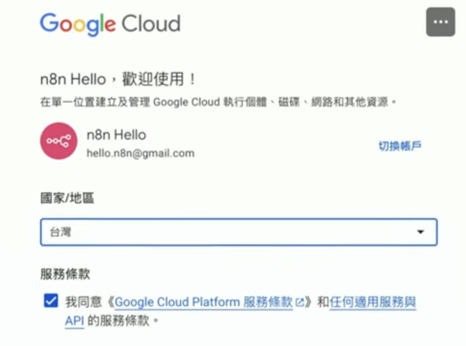
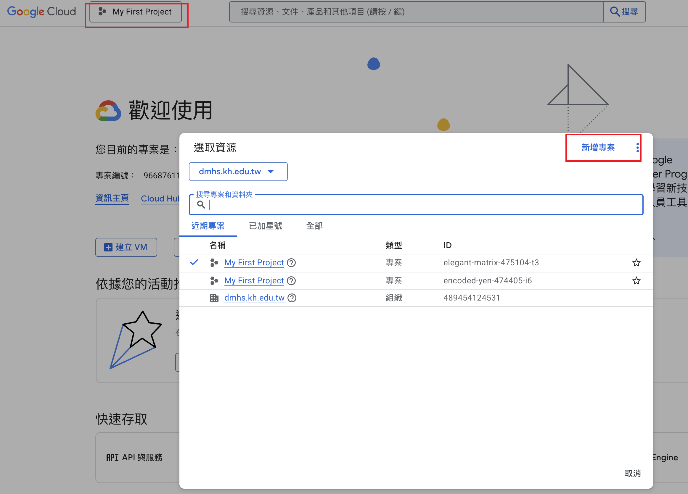
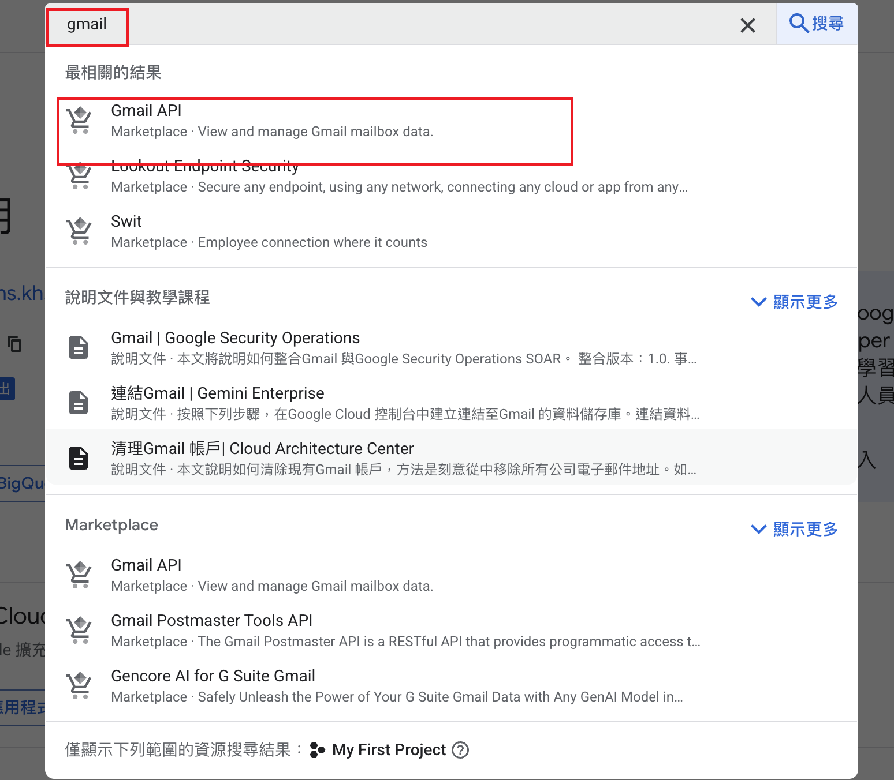
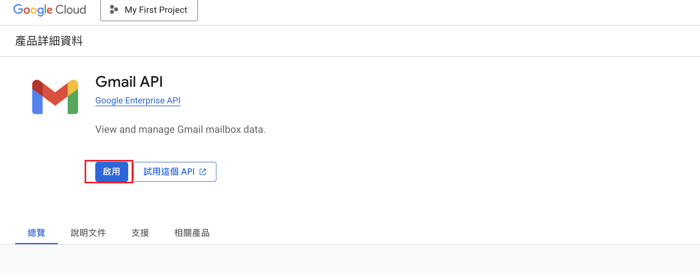
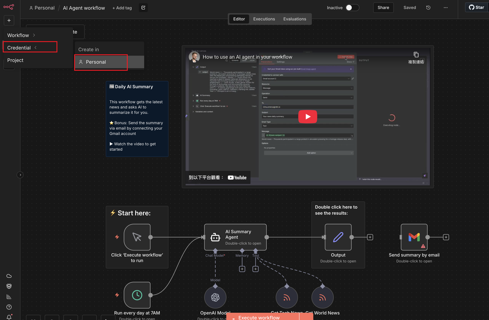
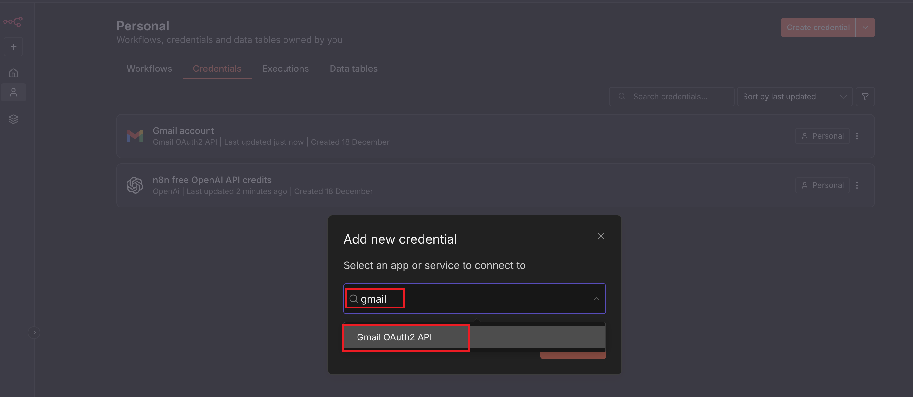
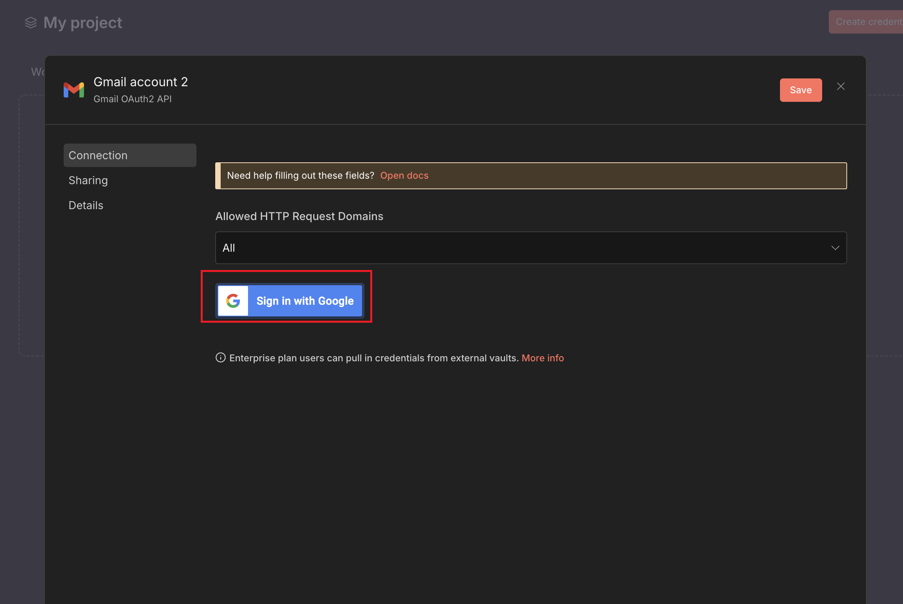
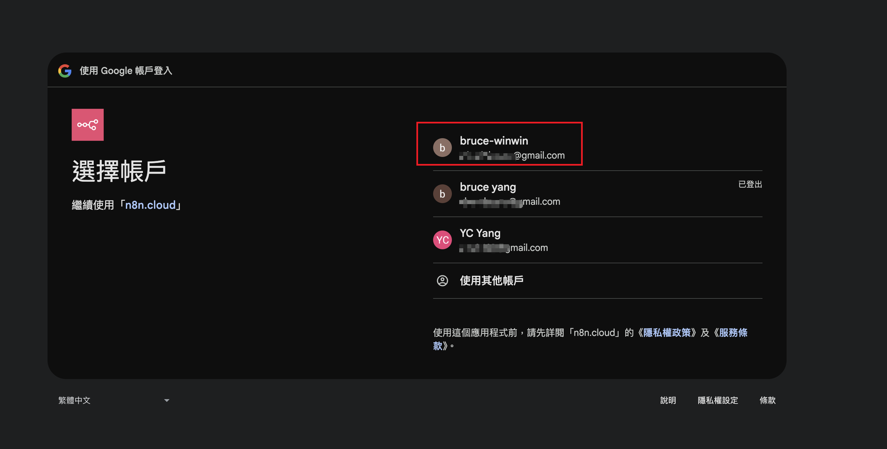
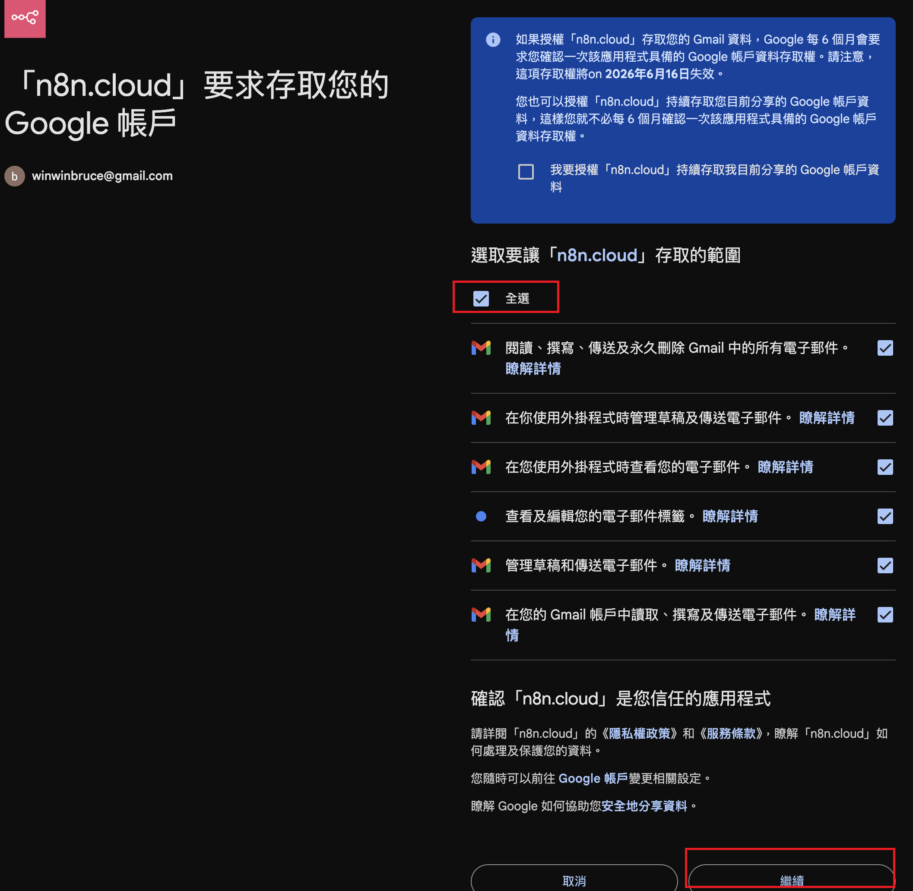

# n8n Gmail Node 串接與 OAuth2 設定指南

本指南將協助您在 Google Cloud Platform (GCP) 建立 OAuth2 憑證，並將其設定至 n8n 以使用 Gmail 節點。

## 前置準備

*   一個 Google 帳號
*   一個運作中的 n8n 實例
*   n8n 的 OAuth Redirect URL (通常在 n8n 憑證設定頁面可以看到，例如 `https://您的n8n域名/rest/oauth2-credential/callback`)

---

## 步驟一：在 Google Cloud Console 建立專案

1.  前往 [Google Cloud Console](https://console.cloud.google.com/)。
2.  點擊左上角的專案選擇器，選擇 **"New Project" (新增專案)**。
3.  輸入專案名稱 (例如 "n8n-gmail-automation") 並點擊 **"Create" (建立)**。
4.  確認已切換至剛建立的專案。

## 步驟二：啟用 Gmail API

1.  在左側選單中，前往 **"APIs & Services" (API 和服務) > "Library" (程式庫)**。
2.  在搜尋欄輸入 `Gmail API`。
3.  點擊搜尋結果中的 **"Gmail API"**。
4.  點擊 **"Enable" (啟用)** 按鈕。

## 步驟三：設定 OAuth 同意畫面 (Consent Screen)

1.  前往 **"APIs & Services" (API 和服務) > "OAuth consent screen" (OAuth 同意畫面)**。
2.  **User Type (使用者類型)** 選擇：
    *   **External (外部)**：如果您使用的是一般 Gmail (@gmail.com)，選這個。
    *   **Internal (內部)**：如果您使用的是 Google Workspace 組織帳號，且只想讓組織內部使用，選這個。
3.  點擊 **"Create" (建立)**。
4.  **App Information (應用程式資訊)**：
    *   **App name**：輸入識別名稱 (例如 "n8n Gmail")。
    *   **User support email**：選擇您的 Email。
    *   **Developer contact information**：輸入您的 Email。
5.  點擊 **"Save and Continue"**。
6.  **Scopes (範圍)**：
    *   點擊 **"Add or Remove Scopes"**。
    *   搜尋並勾選 `https://mail.google.com/` (這會給予完全權限，或者您可以只勾選需要的特定權限如 `.../auth/gmail.send`)。
    *   點擊 **"Update"**，然後 **"Save and Continue"**。
7.  **Test Users (測試使用者)** (僅限 External 模式且未發布應用程式時)：
    *   點擊 **"Add Users"**。
    *   輸入您要用來登入 n8n 的 Google Email 地址。
    *   *注意：如果沒有加入測試使用者，在這個階段會無法登入。*
    *   點擊 **"Save and Continue"**。

## 步驟四：建立 OAuth 憑證 (Client ID & Secret)

1.  前往 **"APIs & Services" (API 和服務) > "Credentials" (憑證)**。
2.  點擊上方 **"+ CREATE CREDENTIALS" (建立憑證) > "OAuth client ID" (OAuth 用戶端 ID)**。
3.  **Application type (應用程式類型)** 選擇 **"Web application" (網頁應用程式)**。
4.  **Name**：輸入識別名稱 (例如 "n8n Client")。
5.  **Authorized redirect URIs (已授權的重新導向 URI)**：
    *   點擊 **"ADD URI"**。
    *   **這裡非常重要！** 請回到您的 n8n 介面：
        1.  新增一個 Gmail 節點。
        2.  在 "Credential to connect with" 選擇 "Create New"。
        3.  選擇 "Google Gmail OAuth2 API"。
        4.  複製介面上顯示的 **"OAuth Redirect URL"**。
    *   將複製的 URL 貼回 Google Cloud Console 的欄位中。
6.  點擊 **"Create" (建立)**。
7.  畫面會跳出 **Your Client ID** 和 **Your Client Secret**。請將這兩串亂碼複製下來（或下載 JSON 檔）。

## 步驟五：在 n8n 完成設定

1.  回到 n8n 的憑證設定畫面 (Google Gmail OAuth2 API)。
2.  填入資訊：
    *   **Client ID**：貼上剛剛複製的 Client ID。
    *   **Client Secret**：貼上剛剛複製的 Client Secret。
3.  展開下面的 **"Scope"** 欄位 (通常預設已填好，若無可填入 `https://mail.google.com/`)。
4.  勾選 **"Ignore SSL Issues"** (通常建議不勾選，除非您是自架且 SSL 憑證有問題)。
5.  點擊 **"Sign in with Google"** 按鈕。
6.  會跳出 Google 登入視窗：
    *   選擇您在「測試使用者」中設定的帳號。
    *   因為應用程式未經 Google 驗證，可能會看到「Google hasn't verified this app」的警告。點擊 **"Advanced" (進階) > "Go to n8n Gmail (unsafe)"** 繼續。
    *   勾選授權項目並點擊 **"Continue" (繼續)**。
7.  視窗關閉後，n8n 應顯示 **"Connection test successful"** 或類似的成功訊息。

## 完成

現在您可以在 n8n 的 Gmail 節點中使用此憑證來讀取郵件、發送郵件或管理標籤了！

## 參考截圖

| 步驟 (參考) | 截圖 |
| --- | --- |
| 1 |  |
| 2 |  |
| 3 |  |
| 4 |  |
| 10 |  |
| 11 |  |
| 12 |  |
| 13 |  |
| 14 |  |